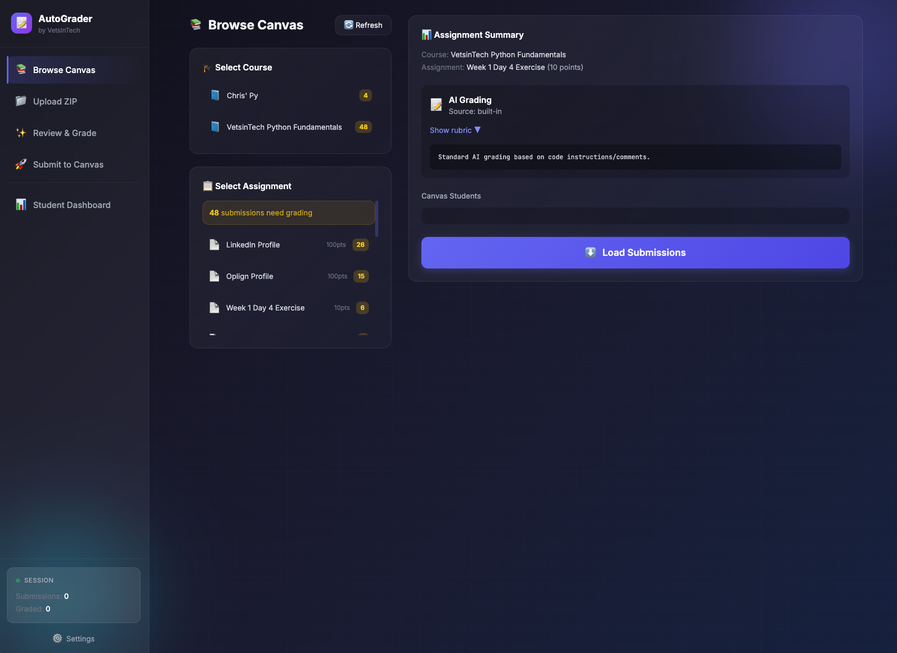

# AutoGrader

<p align="center">
  
</p>

<p align="center">
  <a href="https://github.com/staticoverdub/vit-autograder/actions/workflows/test.yml"></a>
  <a href="LICENSE"></a>
</p>

An AI-powered, configurable tool to automatically grade Python assignments and submit grades to Canvas LMS.

<p align="center">
  
</p>

## Features

- **Canvas Integration**: Browse courses, download submissions, submit grades
- **AI-Powered Grading**: Uses Claude to provide encouraging, constructive feedback
- **Configurable**: Customize organization branding, grading style, and messages
- **Student Dashboard**: Track student progress, send celebrations and reminders
- **Multiple Grading Modes**: Standard, final project (rubric-based), and check-off assignments

## Quick Start

### 1. Configure Your Organization

Copy the example configuration and customize for your organization:

```bash
cp config.yaml.example config.yaml
```

Edit `config.yaml` with your organization details:

```yaml
organization:
  name: "Your Organization"
  website: "https://example.com"

canvas:
  url: "https://yourschool.instructure.com"

course:
  name: "Introduction to Python"
```

### 2. Set Up API Keys

Create a `.env` file with your API credentials (Or just use the settings menu!) :

```bash
cp .env.example .env
```

Edit `.env` with your keys:

```bash
CANVAS_TOKEN=your_canvas_api_token_here
ANTHROPIC_API_KEY=your_anthropic_api_key_here
```

### 3. Run with Docker (Recommended)

```bash
docker-compose up --build
```

Open http://localhost:5001

### Alternative: Run Locally

```bash
pip install -r requirements.txt
python app.py
```

Open http://localhost:5000

---

## Configuration

### config.yaml

The main configuration file controls organization branding, grading behavior, and message templates.

| Section | Description |
|---------|-------------|
| `organization` | Name, website, tagline for branding |
| `instructor` | Name and sign-off for messages |
| `canvas` | Canvas LMS URL |
| `course` | Course name, type, and audience description |
| `grading` | Points, leniency, timeout, libraries, model |
| `messages` | Celebration and reminder message settings |

### Environment Variables

API credentials should be kept in `.env` (not committed to git):

| Variable | Description |
|----------|-------------|
| `CANVAS_TOKEN` | Canvas API token |
| `ANTHROPIC_API_KEY` | Anthropic API key for Claude |
| `CANVAS_URL` | (Optional) Override config.yaml Canvas URL |
| `ORG_NAME` | (Optional) Override organization name |

### Prompt Templates

Customize grading prompts by editing files in the `prompts/` directory:

- `grading_standard.j2` - Regular assignment grading
- `grading_final_project.j2` - Detailed rubric-based grading
- `grading_single.j2` - Single submission grading
- `celebration_message.j2` - Course completion celebration
- `reminder_message.j2` - Missing assignments reminder

---

## How to Use

### Step 1: Browse Canvas
- Select your course and assignment
- View which submissions need grading
- Download ungraded submissions

### Step 2: Review & Grade
- AI grades each submission with encouraging feedback
- Review and edit grades/comments as needed
- Run student code to verify functionality

### Step 3: Submit to Canvas
- Review pending grades
- Submit all grades with one click
- Grades and comments posted automatically

### Student Dashboard
- Track student progress across all assignments
- Send celebration messages to students who complete the course
- Send reminders to students with missing assignments

---

## Getting API Keys

### Canvas API Token
1. Log into Canvas
2. Go to Account → Settings
3. Scroll to "Approved Integrations"
4. Click "+ New Access Token"
5. Name it "AutoGrader" and generate

### Anthropic API Key
1. Go to https://console.anthropic.com/
2. Create an account or sign in
3. Go to API Keys
4. Create a new key

---

## Grading Modes

### Standard Grading
AI grades based on code functionality and instructions in the code comments.

### Final Project Grading
Uses a detailed rubric (can be fetched from Canvas wiki pages or defined in config).

### Check-off Assignments
Auto-grades with full credit if anything is submitted. Configure patterns in `config.yaml`:

```yaml
grading:
  checkoff_patterns:
    - linkedin
    - profile
    - setup
```

---

## Customization

### Grading Leniency

Set in `config.yaml`:

```yaml
grading:
  leniency: "lenient"  # strict, moderate, or lenient
```

### Message Resources

Customize celebration message links:

```yaml
messages:
  celebration:
    resources:
      - label: "More Courses"
        url: "https://example.com/courses"
    next_steps:
      - "Advanced Python"
      - "Web Development"
```

---

## Troubleshooting

**"Could not match to Canvas student"**
- The filename format may not match Canvas usernames
- Ensure the ZIP was downloaded from Canvas

**"Failed to connect to Canvas"**
- Verify your Canvas token is correct
- Check the Canvas URL in config.yaml matches your institution

**Grades seem off**
- Add more context about assignment requirements
- Review and adjust grades manually
- Consider adjusting leniency setting

---

## Development

### Running Tests

```bash
make install
make test
make lint
```

### Project Structure

```
vit-autograder/
├── app.py              # Main Flask application
├── config.py           # Configuration loader
├── code_runner.py      # Sandboxed Python code execution
├── prompt_loader.py    # Jinja2 prompt template renderer
├── config.yaml         # Your configuration (not in git)
├── prompts/            # Jinja2 prompt templates
│   ├── grading_standard.j2
│   ├── grading_final_project.j2
│   ├── grading_single.j2
│   ├── celebration_message.j2
│   └── reminder_message.j2
├── templates/
│   └── index.html      # Web UI
├── tests/              # Test suite
│   ├── conftest.py
│   ├── test_config.py
│   ├── test_app_logic.py
│   ├── test_code_execution.py
│   └── test_prompt_loader.py
├── .env                # API keys (not in git)
├── .env.example        # Example env file
├── Makefile            # Development commands
├── docker-compose.yml
└── requirements.txt
```

---

## Contributing

See [CONTRIBUTING.md](CONTRIBUTING.md) for development workflow, coding standards, and how to submit pull requests.

## License

[MIT License](LICENSE)
